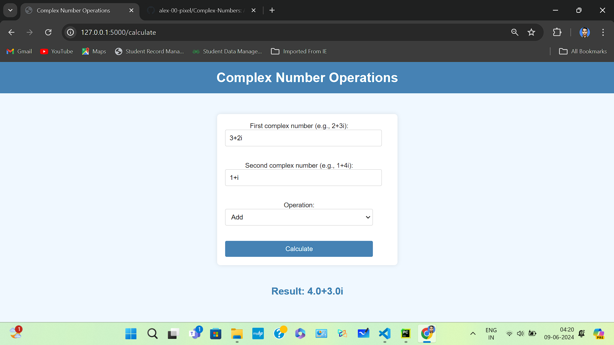

# Complex Number Operations Web App

This is a web application for performing operations on complex numbers. The application is built using Flask and provides a user-friendly interface to input complex numbers and choose an operation (addition, subtraction, multiplication, division).

## Features

- Add, subtract, multiply, and divide complex numbers.
- User-friendly interface with input validation.
- Handles various input formats such as `3`, `3+i`, `3+2i`, `0`, etc.

## Demo

## Requirements

- Python 3.11
- Flask

